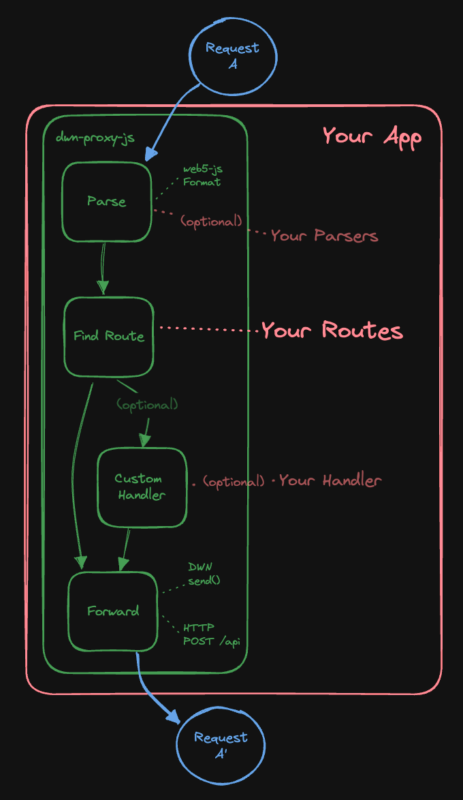

# DWN Proxy

Making DWN integrations with traditional backend services easy.

⚠️ UNDER DEVELOPMENT ⚠️

`dwn-proxy-js` is a bidirectional proxy between [Decentralized Web Nodes](https://identity.foundation/decentralized-web-node/spec) and your web services.


# Usage

At it's lightest, this package can act as a network router for DWM's. At it's heaviest, this package can be used to selectively abstract DWN-concepts from your web services. You have optionality as to the degree to which you differentiate across the two network interfaces.

```cli
npm install @tbd54566975/dwn-proxy-js
```

```typescript
import { Message, Matches, Server } from "dwn-proxy-js";
import http from 'http';

const PORT = 3001;

const yourMatches = new Matches();
yourMatches.add({
  interface: 'Records',
  method: 'Write',
  protocol: 'tbdex',
  schema: 'rfq',
  destination: 'developer.tbd.website/some-api/rfq',
  handler: (message: Message): Message => {
    // some custom handler logic
    return {...message} // you can augment this thing here
  }
});
yourMatches.add({
  // ... more matches
})

Server.start(
  PORT,
  yourMatches
);
```



## Parsing

...

## Auth

...

## Matches

...

## TODO design considerations

TODO: take more things from https://github.com/TBD54566975/dwn-relay/blob/main/docs/design-doc.md

## Project Resources

| Resource                                   | Description                                                                   |
| ------------------------------------------ | ----------------------------------------------------------------------------- |
| [CODEOWNERS](./CODEOWNERS)                 | Outlines the project lead(s)                                                  |
| [CODE_OF_CONDUCT.md](./CODE_OF_CONDUCT.md) | Expected behavior for project contributors, promoting a welcoming environment |
| [CONTRIBUTING.md](./CONTRIBUTING.md)       | Developer guide to build, test, run, access CI, chat, discuss, file issues    |
| [GOVERNANCE.md](./GOVERNANCE.md)           | Project governance                                                            |
| [LICENSE](./LICENSE)                       | Apache License, Version 2.0                                                   |