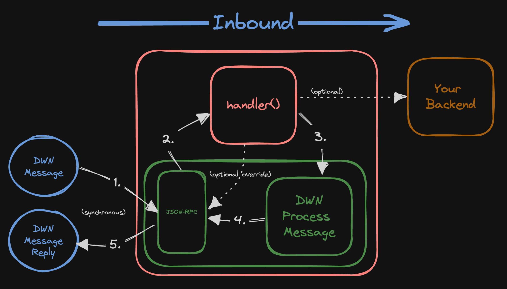
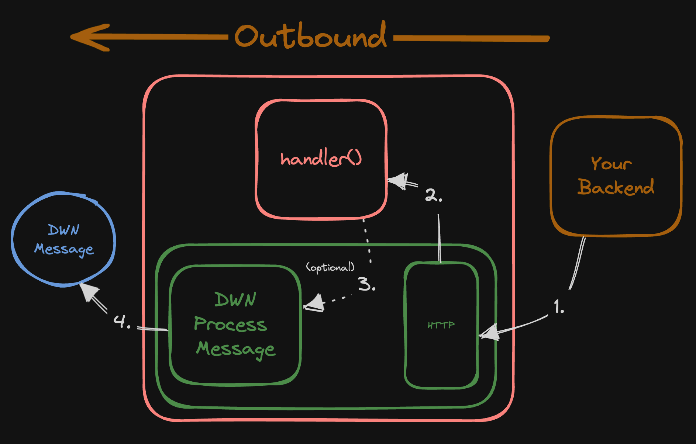

# DWN Proxy <!-- omit in toc -->

Making DWN integrations with traditional backend services easy.

⚠️ UNDER DEVELOPMENT ⚠️

`dwn-proxy-js` is a bidirectional proxy between [Decentralized Web Nodes](https://identity.foundation/decentralized-web-node/spec) and your web services.

* [Design](#design)
* [Usage](#usage)
* [`App.records.query(handler)`](#apprecordsqueryhandler)
* [`App.records.write(handler)`](#apprecordswritehandler)
* [`App.post(path, handler)`](#apppostpath-handler)
* [Project Resources](#project-resources)


# Design

At it's lightest, this package can act as a network router for DWN Message's. At it's heaviest, this package can be used to selectively abstract DWN-concepts from your web services. You have optionality as to the degree to which you differentiate across the two network interfaces.

Like the [`dwn-server`](https://github.com/TBD54566975/dwn-server), this package is intended to be used server-side, wherein DWN Messages are interfaced with via JSON-RPC (compatible with [`web5-js`](https://github.com/TBD54566975/web5-js)'s Agent [interface](https://github.com/TBD54566975/web5-js/tree/main/packages/web5-agent)). Also like [`dwn-server`](https://github.com/TBD54566975/dwn-server), this package uses the [`dwn-sdk-js`](https://github.com/TBD54566975/dwn-sdk-js) to implement a fully-featured DWN. However, unlike [`dwn-server`](https://github.com/TBD54566975/dwn-server), this package offers a programmatic interface for handling DWN Messages, both inbound and outbound, with the design intent of integrating with traditional backend services.

Handlers will **always** be called *prior-to* the underlying DWN Processing (that is, `dwn.processMessage()`), and based on the `return` of the handler, then DWN Processing may be avoided altogether.

Handlers for inbound DWN Messages must be defined in order for the underlying DWN to accept and process messages. If a handler for the given `{Interface}{Method}` is not defined (ex: `RecordsWrite`) then all messages for that given `{Interface}{Method}` will be rejected.

---

*Note:* we should reconsider the project composition in relation to `dwn-server`. The two projects are distinct developer products, but they have significant overlap which can be isolated to a shared package. `dwn-json-rpc-js` could be a package which implements a fully-features DWN, using `dwn-sdk-js`, interfaced via JSON-RPC, which offers optional programmatic callbacks both prior-to and post DWN Message processing (that is, `dwn.processMessage()`).

---





# Usage


```cli
npm install @tbd54566975/dwn-proxy-js
```

```typescript
import { App } from '@tbd54566975/dwn-proxy-js';

const app = new App();

// your inbound handler for RecordsWrite's
app.records.write(
  async message => {
    const { descriptor: { protocol, schema }} = message;

    if (protocol === 'TBDEX' && schema === 'RFQ') {
      const response = await fetch(`/your/api/rfq`);
      return response.status === 200;
    }

    return false; // dwn.processMessage() will not be called
  }
);

// your outbound API
app.post('/api/quote', async req => {
  // you could do your own custom auth here
  const { targetDid, quote } = await req.body.json();

  // returning this will send the DWN Message to the targetDid
  return { 
    targetDid,
    data: quote
  };
});

const PORT = 3000;
app.listen(PORT);
```

# `App.records.query(handler)`

Method for handling inbound `RecordsQuery` DWN Messages.

```typescript
app.records.query(
  async message => { // handler function
    // space for custom middleware
    await myCustomMiddleware(message);

    // you can override the default DWN 
    // records querying with your own records
    if (message.descriptor.something)
      return myCustomRecord;
  }
);
```

`handler` - `(message: DwnMessage) => Promise<void | Record>`
  - If the return type is `void` then the underlying DWN will read from its own record store
  - Else if the return type is `Record` then the given record will be immediately returned to the requestor

# `App.records.write(handler)`

Method for handling inbound `RecordsWrite` DWN Messages.

```typescript
app.records.write(
  async message => {
    const { descriptor: { protocol, schema }} = message;

    if (protocol === 'TBDEX' && schema === 'RFQ') {
      const response = await fetch(`/your/api/rfq`);
      return response.status === 200;
    }

    return false;
  }
);
```

`handler` - `(message: DwnMessage) => Promise<boolean>`
  - If the return is `true` then `dwn.processMessage()` will be called
  - Else if the return is `false` then `dwn.processMessage()` will **not** be called and will immediately respond to the requestor with an error code

# `App.post(path, handler)`

Method for defining an outbound HTTP POST API call.

```typescript
app.post('/api/something', async req => {
  const { targetDid, something } = await req.body.json();

  // returning this will send the DWN Message to the targetDid
  return { 
    targetDid,
    data: something
  };
});

app.post('/api/something-else', async req => {
  const somethingElse = await req.body.json();
  await someCustomMiddleware(somethingElse);
  // void return means no DWN Message is sent on
});
```

`path` - HTTP path 

`handler` - `(req) => Promise<void | Record>`
  - If return type is `void` then no DWN processing occurs neither is a subsequent DWN Message sent on
  - Else if the return type is `Record` then
    - The record is written to ones own DWN
    - The record is sent onwards (as a message) to the `targetDid`

# Project Resources

| Resource                                   | Description                                                                   |
| ------------------------------------------ | ----------------------------------------------------------------------------- |
| [CODEOWNERS](./CODEOWNERS)                 | Outlines the project lead(s)                                                  |
| [CODE_OF_CONDUCT.md](./CODE_OF_CONDUCT.md) | Expected behavior for project contributors, promoting a welcoming environment |
| [CONTRIBUTING.md](./CONTRIBUTING.md)       | Developer guide to build, test, run, access CI, chat, discuss, file issues    |
| [GOVERNANCE.md](./GOVERNANCE.md)           | Project governance                                                            |
| [LICENSE](./LICENSE)                       | Apache License, Version 2.0                                                   |