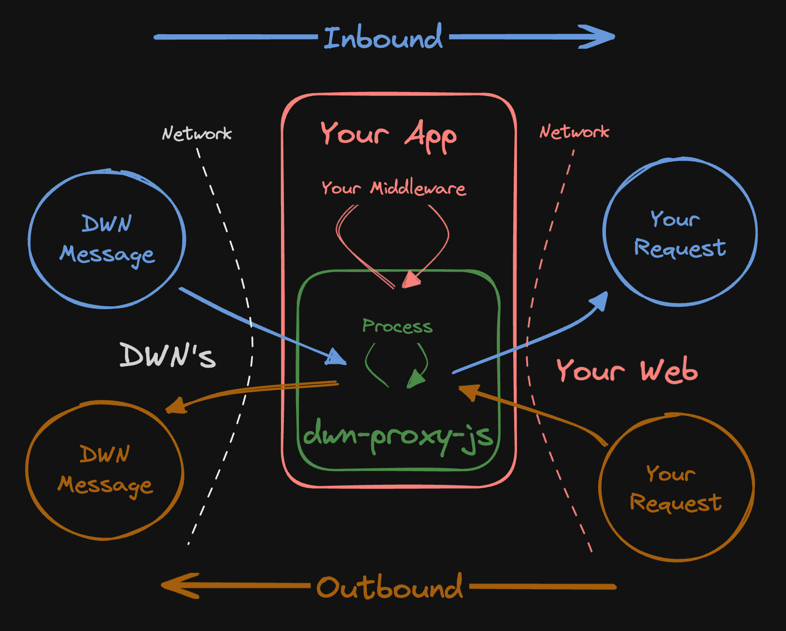
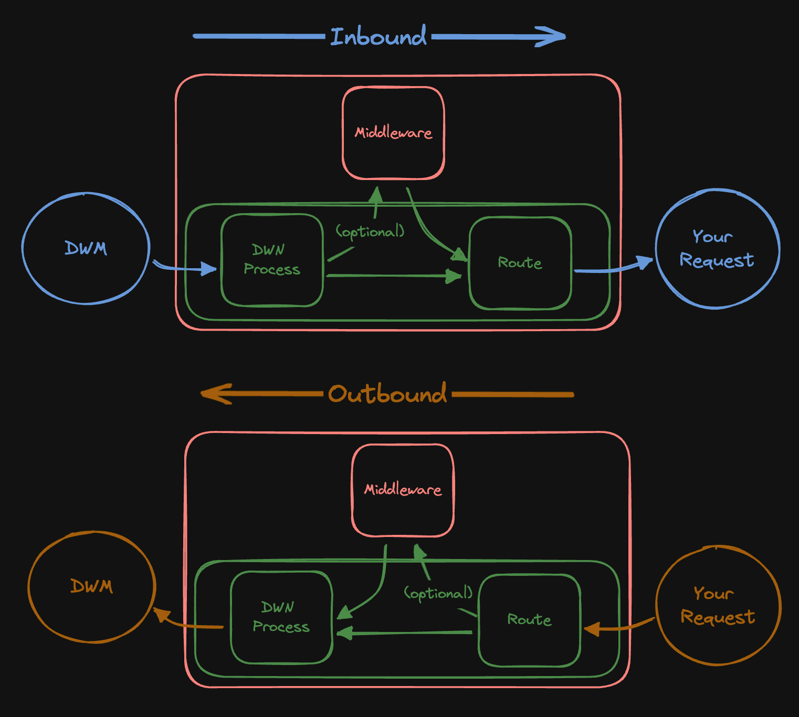

# DWN Proxy

Making DWN integrations with traditional backend services easy.

⚠️ UNDER DEVELOPMENT ⚠️

`dwn-proxy-js` is a bidirectional proxy between [Decentralized Web Nodes](https://identity.foundation/decentralized-web-node/spec) and your web services.



# Usage

At it's lightest, this package can act as a network router for DWM's. At it's heaviest, this package can be used to selectively abstract DWN-concepts from your web services. You have optionality as to the degree to which you differentiate across the two network interfaces.

TODO: explain what DWN-specific things this does for you

```cli
npm install @tbd54566975/dwn-proxy-js
```

```typescript
import { App } from './types';

const app = new App();

// TODO okay now I'm wondering... do I need to differentiate inbound vs outbound?
// could just do app.records.write() is assumed inbound
// and app.post('/quote') is assumed outbound

app.inbound.records.write({ schema: 'rfq', protocol: 'tbdex' }, (msg, next) => {
  console.log(msg);
  next();
});

app.outbound.post('/quote', (req, res) => {
  // write middleware for the given outbound request
  console.log(req, res);
  return {
    some: 'dwm'
  };
});

const INBOUND_PORT = 3000;
const OUTBOUND_PORT = 3001;
app.listen(INBOUND_PORT, OUTBOUND_PORT);
```

## How It Works



## DWN Process

...

## Middleware

- Auth
- Request augmentation
- other things???

...

## Route

Right now, it's just HTTP fetch requests

...

## TODO design considerations

Intended to be server side applications

TODO think about examples

TODO: take more things from https://github.com/TBD54566975/dwn-relay/blob/main/docs/design-doc.md

## Project Resources

| Resource                                   | Description                                                                   |
| ------------------------------------------ | ----------------------------------------------------------------------------- |
| [CODEOWNERS](./CODEOWNERS)                 | Outlines the project lead(s)                                                  |
| [CODE_OF_CONDUCT.md](./CODE_OF_CONDUCT.md) | Expected behavior for project contributors, promoting a welcoming environment |
| [CONTRIBUTING.md](./CONTRIBUTING.md)       | Developer guide to build, test, run, access CI, chat, discuss, file issues    |
| [GOVERNANCE.md](./GOVERNANCE.md)           | Project governance                                                            |
| [LICENSE](./LICENSE)                       | Apache License, Version 2.0                                                   |