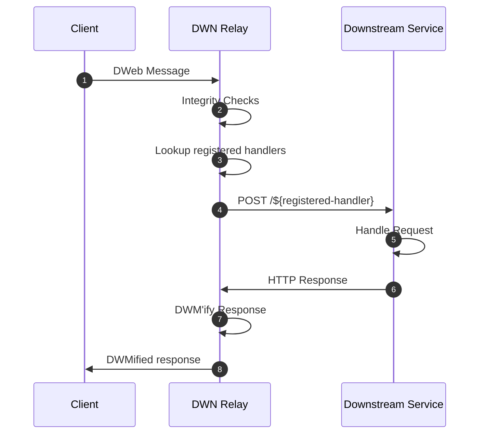

# DWN Proxy

Making DWN integrations with traditional backend services easy.

⚠️ UNDER DEVELOPMENT ⚠️

`dwn-proxy-js` is a bidirectional proxy between [Decentralized Web Nodes](https://identity.foundation/decentralized-web-node/spec) and your web API.


The primary motivation behind this package is to streamline the ability for traditional back-end services that expose web APIs to receive & send DWN messages (a.k.a DWeb Messages or a.k.a DWM's). The default behavior of this package is designed to prevent the leakage of DWN awareness or concepts into a downstream service.

## Process

- Message validation
- DWM authorization
- other things???

## TODO design considerations

Two separate HTTP servers, with distinct port-bindings, one for inbound and the other for outbound. Therefore, network security topology can be configured distinctly. TODO is this truly necessary???

For inbound, `Process` occurs first then `Your handler` second. Four outbound, the inverse, `Your handler` occurs first then `Process` second.

Sequence diagram?

Single-tenant DID owner-operator. Meaning, inbound authorization is performed. 



# dwn-proxy-js Message (DPM)

TODO... these are requests on the right-hand-side

```json
{
  // what's the structure here?
}
```

---

TODO: take more things from https://github.com/TBD54566975/dwn-relay/blob/main/docs/design-doc.md

TODO
```cli
npm install @tbd54566975/dwn-proxy@0.0.1
```

## Project Resources

| Resource                                   | Description                                                                   |
| ------------------------------------------ | ----------------------------------------------------------------------------- |
| [CODEOWNERS](./CODEOWNERS)                 | Outlines the project lead(s)                                                  |
| [CODE_OF_CONDUCT.md](./CODE_OF_CONDUCT.md) | Expected behavior for project contributors, promoting a welcoming environment |
| [CONTRIBUTING.md](./CONTRIBUTING.md)       | Developer guide to build, test, run, access CI, chat, discuss, file issues    |
| [GOVERNANCE.md](./GOVERNANCE.md)           | Project governance                                                            |
| [LICENSE](./LICENSE)                       | Apache License, Version 2.0                                                   |