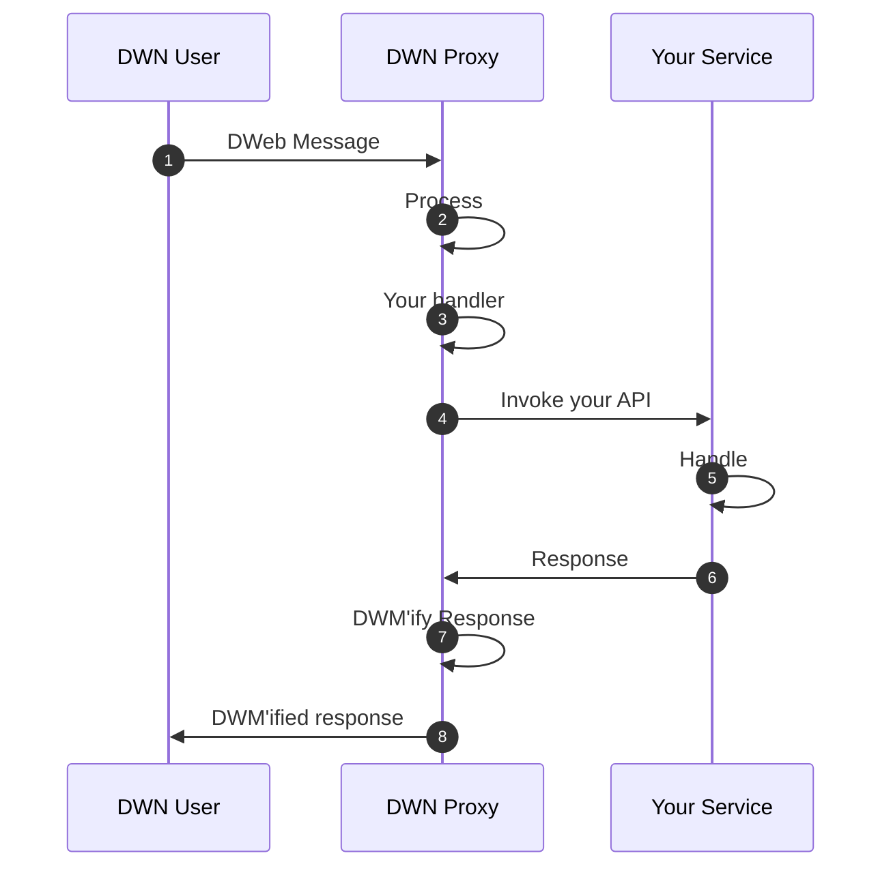
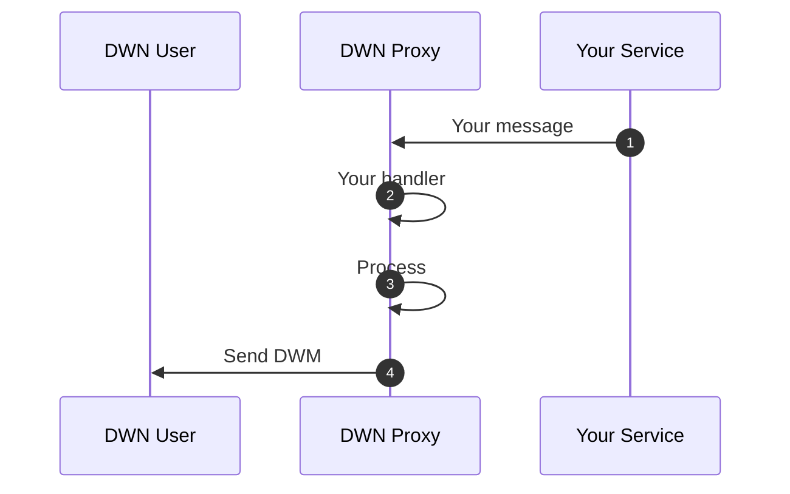
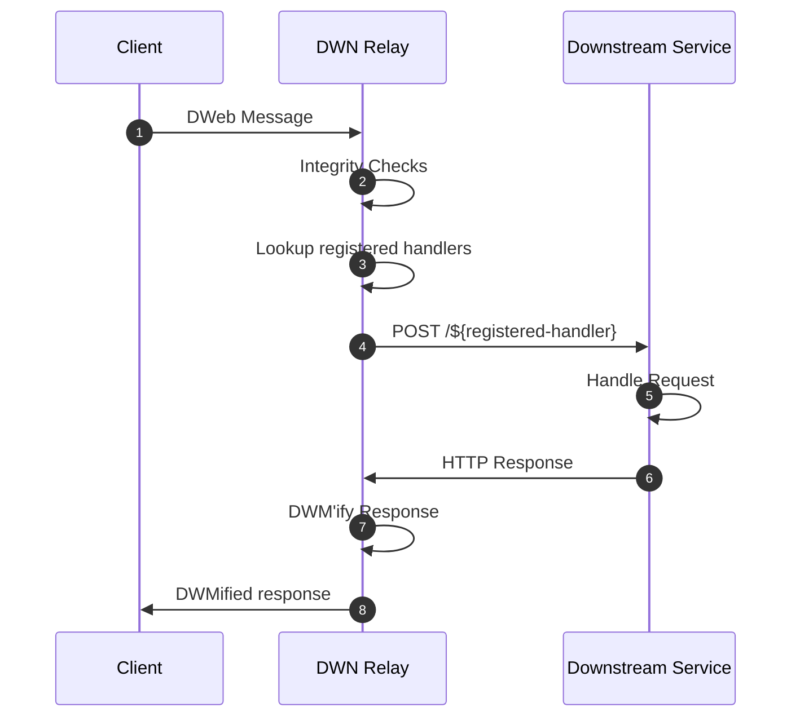

# DWN Proxy

Making DWN integrations with traditional backend services easy.

⚠️ UNDER DEVELOPMENT ⚠️

`dwn-proxy-js` is a bidirectional proxy between [Decentralized Web Nodes](https://identity.foundation/decentralized-web-node/spec) and your web services.


TODO: Merely source-destination mapping (based on message contents) and subsequent network execution. Optional custom callback for each mapping (useful for auth, or message augmentation).

# Usage

At it's lightest, this package can act as a network router for DWM's. At it's heaviest, this package can be used to entirely abstract DWN-concepts from your web services. You have optionality as to the degree to which you differentiate across the two network interfaces.

## Mappings

...

## Optional Custom Handler

...

```cli
npm install @tbd54566975/dwn-proxy-js
```

```typescript
import {} from "dwn-proxy-js"

// configure single-tenant DID owner-operator
// define handler(s)
// start server
```

## (Optional) Configuration Handlers

This package offers an interface, `DwnProxyConfiguration`, which is intended to streamline the intended processing & handling of requests.

```typescript
import {} from "dwn-proxy-js"

// read config files, using imported code
// pass config handler when starting server
```

## Inbound 



## Outbound 



---
---

## Process

- Message validation
- DWM authorization
- other things???

## TODO design considerations

Two separate HTTP servers, with distinct port-bindings, one for inbound and the other for outbound. Therefore, network security topology can be configured distinctly. TODO is this truly necessary???

For inbound, `Process` occurs first then `Your handler` second. Four outbound, the inverse, `Your handler` occurs first then `Process` second.

Sequence diagram?

Single-tenant DID owner-operator. Meaning, inbound authorization is performed. 

Should we be transport-agnostic? Which is to say, the `Your handler` would/could define the forward mechanism?



OpenAPI docs for the outbound API calls?

Starting to think inbound & outbound should be discrete processes... or maybe actually the library shouldn't be that prescriptive. If the developer wanted separate processes, then they could host two different instances.

Motivations: developer-friendly but also security cognizant

---

TODO: take more things from https://github.com/TBD54566975/dwn-relay/blob/main/docs/design-doc.md

# dwn-proxy-js Message (DPM)

TODO... these are requests on the right-hand-side

```json
{
  // what's the structure here?
}
```

# Usage

You can use `dwn-proxy-js` as a either a package or an executable. As a package, you have full NodeJS programmatic optionality for your custom handlers. As an executable, you must follow the [constrained JSON schema](#configuration-schema) for defining your handlers.

## As A Package

```cli
npm install @tbd54566975/dwn-proxy-js@0.0.1
```

```typescript
import {} from "dwn-proxy-js"

// start server
// define handler(s)
```

## As An Executable

```json
// contents of `config.json`
[
  {
    // filter & mapping
  }
]
```

```cli
npx @tbd54566975/dwn-proxy-js@0.0.1 --config ./config.json
```

### Configuration Schema

```json
{}
```

## Project Resources

| Resource                                   | Description                                                                   |
| ------------------------------------------ | ----------------------------------------------------------------------------- |
| [CODEOWNERS](./CODEOWNERS)                 | Outlines the project lead(s)                                                  |
| [CODE_OF_CONDUCT.md](./CODE_OF_CONDUCT.md) | Expected behavior for project contributors, promoting a welcoming environment |
| [CONTRIBUTING.md](./CONTRIBUTING.md)       | Developer guide to build, test, run, access CI, chat, discuss, file issues    |
| [GOVERNANCE.md](./GOVERNANCE.md)           | Project governance                                                            |
| [LICENSE](./LICENSE)                       | Apache License, Version 2.0                                                   |