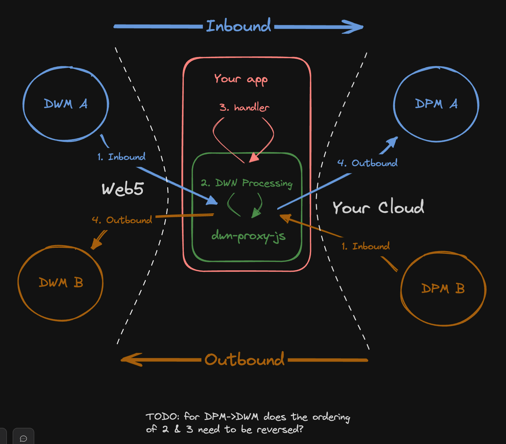
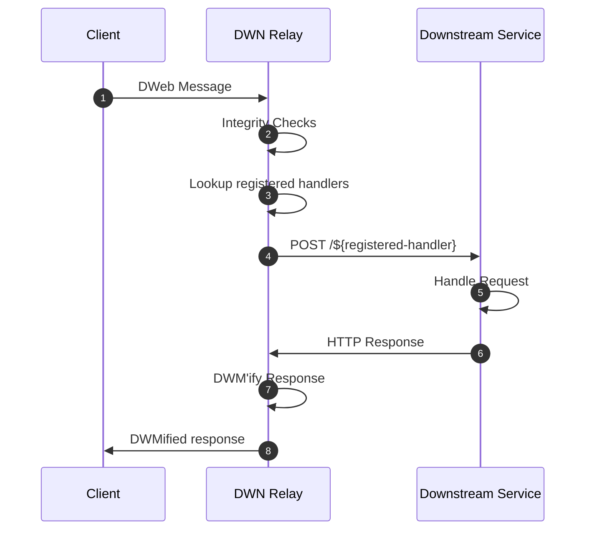

# DWN Proxy

Making DWN integrations with traditional backend services easy.

⚠️ UNDER DEVELOPMENT ⚠️

`dwn-proxy-js` is a bidirectional proxy between [DWN Messages](https://identity.foundation/decentralized-web-node/spec/#messages) (a.k.a DWeb Messages or DWM's) and RESTful APIs.



TODO: change `HTTP A` to `DPH A`

The intended usage of this package is to translate between DWM's and HTTP requests. 

...or is it...

The intended usage of this package is to be a fully-compliant [Decentralized Web Node (DWN)](https://identity.foundation/decentralized-web-node/spec), served over an HTTP interface, with a single-tenant DID owner-operator, and bidirectionally accept & send communications between DWN users and traditional backend services.

...or is it...

The intended usage of this package is to host a server, interfaced via HTTP (& eventually WebSockets?), which receives either [DWN Messages](https://identity.foundation/decentralized-web-node/spec/#messages) or classic HTTP RESTful requests, offer a programmatic handler, and subsequently forward the communication to the appropriate destination.

...or is it...

The intended usage of this package is to host an HTTP (& WebSockets) server, which...
1. Receive DWN-compatible communication: either [DWN Messages](https://identity.foundation/decentralized-web-node/spec/#messages) or [dwn-proxy-js formatted HTTP requests](#http-structure)
2. Perform validation
3. Call developer-defined handler (i.e. an authentication handler)
4. Forward the communication onto the desired destination

This package makes no prescriptions on...
- Authorization
- DWN rule-following
- other things...?

Basically, it starts up an HTTP server, accepts requests which are intended to be DWM-compatible, performs a validation check on the data, offers a programmatic handler/callback, and then formats & forwards it on.

...or is it...

Developer defines a filter, which filters data from DWN-to-HTTP, and vice versa would add the necessary fields when going from HTTP-to-DWN.


# dwn-proxy-js HTTP Structure (DPH???)

TODO... these are requests on the right-hand-side

---


...???The primary intent of `dwm-proxy-js` is to be a translational layer between the DWN Message data structure and classic RESTful HTTP data structures. However, there are additional layers of functionality offered such 


---

`dwn-proxy` is a bidirectional JSON-RPC proxy between [DWN Messages](https://identity.foundation/decentralized-web-node/spec/#messages) and traditional RESTful APIs.

The primary motivation behind this package is to streamline the ability for traditional back-end services that expose RESTful APIs to receive & send DWN messages (a.k.a DWeb Messages or a.k.a DWM's). The default behavior of this package is designed to prevent the leakage of DWN awareness or concepts into a downstream service.

TODO
- single-tenant
  - implies private key management
- maybe "handler" instead of "router"
- config file rather than code?
  - would be useful for non-js devs, if they wanted to use it as a distributable
  - why not both?
- auth
  - both inbound (handled by DWN default behavior?)
  - and outbound 
- is this a fully-compliant DWN or is it simply a pass-thru?
  - why not both?
- make JSON-RPC optional -- 2nd class, it's a supported format, but not enforced


There are actually two different approaches here
1. the package runs the actual servers
2. the package is merely a translational layer
...in both approaches, you could imagine the package still executes any dwn-specific processing (such as auth)


TODO: take more things from https://github.com/TBD54566975/dwn-relay/blob/main/docs/design-doc.md

TODO
```cli
npm install @tbd54566975/dwn-proxy@0.0.1
```



## Project Resources

| Resource                                   | Description                                                                   |
| ------------------------------------------ | ----------------------------------------------------------------------------- |
| [CODEOWNERS](./CODEOWNERS)                 | Outlines the project lead(s)                                                  |
| [CODE_OF_CONDUCT.md](./CODE_OF_CONDUCT.md) | Expected behavior for project contributors, promoting a welcoming environment |
| [CONTRIBUTING.md](./CONTRIBUTING.md)       | Developer guide to build, test, run, access CI, chat, discuss, file issues    |
| [GOVERNANCE.md](./GOVERNANCE.md)           | Project governance                                                            |
| [LICENSE](./LICENSE)                       | Apache License, Version 2.0                                                   |