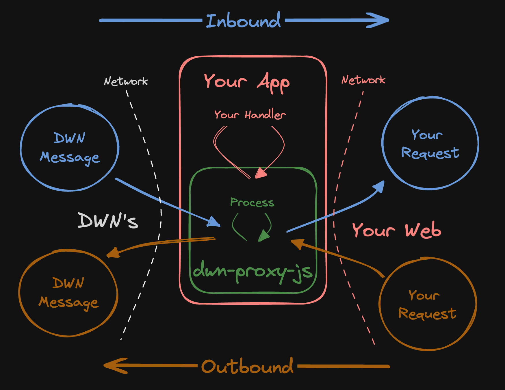

# DWN Proxy

Making DWN integrations with traditional backend services easy.

⚠️ UNDER DEVELOPMENT ⚠️

`dwn-proxy-js` is a bidirectional proxy between [Decentralized Web Nodes](https://identity.foundation/decentralized-web-node/spec) and your web services.



# Usage

At it's lightest, this package can act as a network router for DWM's. At it's heaviest, this package can be used to selectively abstract DWN-concepts from your web services. You have optionality as to the degree to which you differentiate across the two network interfaces.

TODO: explain what DWN-specific things this does for you

```cli
npm install @tbd54566975/dwn-proxy-js
```

```typescript
import { App } from './types';

const app = new App();

/**
 * TODO consider something akin to the app.outbound.post('/something')
 *    such as...
 *    app.inbound.records.write({schema: 'rfq', protocol: 'tbdex'})
 */

app.inbound.routes.push({
  match: msg => {
    if (msg.something)
      return true;
    return false;
  },
  use: (msg, next) => {
    // write middleware for the given route
    next();
  },
});

app.outbound.routes.push({
  match: req => {
    if (req.something)
      return true;
    return false;
  },
  use: (req, res, next) => {
    // write middleware for the given route
    next();
  },
});

const INBOUND_PORT = 3000;
const OUTBOUND_PORT = 3001;
app.listen(INBOUND_PORT, OUTBOUND_PORT);
```

## How It Works


## 1. Standardize

TODO diagram: a bunch of different requests formats --> going into --> `StandardRequest` format

Standardization is the process of translating a request into a `StandardRequest` so that we can find a [route](#2-find-route).

```typescript
import http from 'http';

type StandardRequest = {
  //... whatever which is absolutely necessary to properly do the mapping
}

type ParseFunction = (req: http.IncomingMessage) => StandardRequest;
```

This is where you, the developer, have the chance to define your API specification. 

## 2. Find Route

Routing is the process of mapping requests to destinations & optionally [Custom Functions](#3-custom-function)

## 3. Custom Function

Custom functions allow...
- Auth
- Request augmentation
- other things???

TODO probably could offer common functions

## TODO design considerations

Intended to be server side applications

TODO think about examples

TODO in the Route maybe make the `match` naming more explicit

Instead of "Parse" maybe "Canonicalization"

TODO: take more things from https://github.com/TBD54566975/dwn-relay/blob/main/docs/design-doc.md

## Project Resources

| Resource                                   | Description                                                                   |
| ------------------------------------------ | ----------------------------------------------------------------------------- |
| [CODEOWNERS](./CODEOWNERS)                 | Outlines the project lead(s)                                                  |
| [CODE_OF_CONDUCT.md](./CODE_OF_CONDUCT.md) | Expected behavior for project contributors, promoting a welcoming environment |
| [CONTRIBUTING.md](./CONTRIBUTING.md)       | Developer guide to build, test, run, access CI, chat, discuss, file issues    |
| [GOVERNANCE.md](./GOVERNANCE.md)           | Project governance                                                            |
| [LICENSE](./LICENSE)                       | Apache License, Version 2.0                                                   |