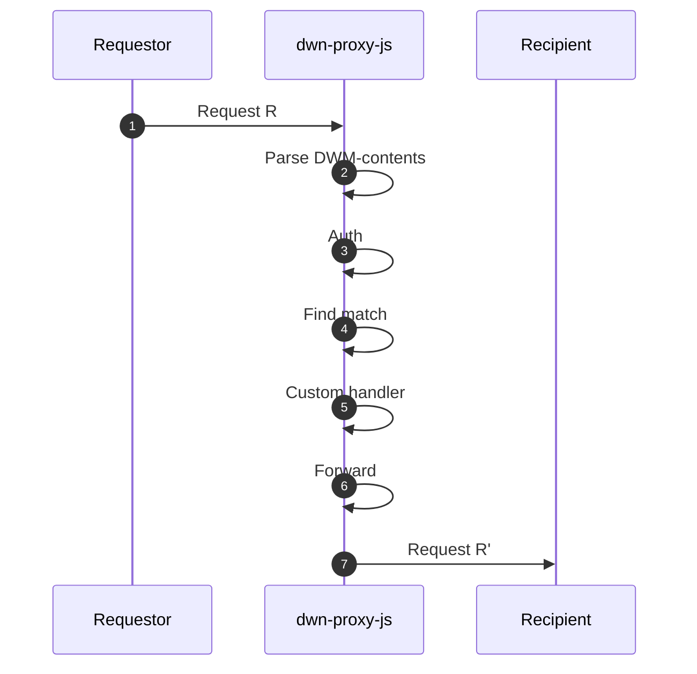

# DWN Proxy

Making DWN integrations with traditional backend services easy.

⚠️ UNDER DEVELOPMENT ⚠️

`dwn-proxy-js` is a bidirectional proxy between [Decentralized Web Nodes](https://identity.foundation/decentralized-web-node/spec) and your web services.


# Usage

At it's lightest, this package can act as a network router for DWM's. At it's heaviest, this package can be used to selectively abstract DWN-concepts from your web services. You have optionality as to the degree to which you differentiate across the two network interfaces.

```cli
npm install @tbd54566975/dwn-proxy-js
```


```typescript
import { Message, Matches, Server } from "dwn-proxy-js";
import http from 'http';

const PORT = 3001;

// this is your custom HTTP API spec for outbound messages
const parseOutbound = (req: http.IncomingMessage): Message => {
  return {
    interface: 'Records',
    method: 'Write'
    // other things
  };
};

const matches = new Matches()
matches.add({
  interface: 'Records',
  method: 'Write',
  handler: (message: Message): Message => {
    // some custom handler logic
    return {...message} // you can augment this thing here
  }
})

Server.start(
  PORT,
  [parseOutbound],
  matches
)
```

```typescript
interface Message {
  interface: string;
  method: string;
  protocol?: string;
  schema?: string;
}

interface Match {
  interface: DwnInterface;
  method: DwnMethod;
  protocol?: string;
  schema?: string;
  did?: string; // this ought to be strongly typed
  handler?(req: Request): Request;
  destination: string; // url or DWN? or what?
}

interface Server {
  port: number;
  parsers: Array<(req: http.IncomingMessage): Message>;
  matches: Array<Match>;
}
```


```typescript
import { Server,  } from 'dwn-proxy-js'
```

## Assumptions

- HTTP-only
- inbound...
  - All messages are DWM's which originate from web5-js
    - This means `dwn-request` in the HTTP header
  - DWN-specific things
    - Can execute DWN-native `authorization` logic
    - Protocol validation?
  - Custom handlers can...
    - Augment the message before forwarding it
- outbound
  - All messages contain at least the minimum contents needed to make a `dwn.send()` call
    - destination DID
    - interface
    - method
    - payload?
    - Maybe this warrants a developer-defined function, `parseOutbound(req): DwnSendInputs`
      - input the request
      - output the necessary pieces to call `dwn.send()`
  - DWN-specific things
    - Protocol validation?
  - Custom handlers can...
    - Add custom auth solution
    - Add additional DWN-specific data, such as `authorization`

```typescript
if (isInbound) {
  dwn.authorization(message)
}
```

1. Parse DWM-required-contents
      - For outbound, pass full `req` to custom parse function
        - This way, dev's can define their own API spec
2. If authorization, then authorize (NOTE: why is this even necessary?)
3. Find match
4. If match has custom handler, then call custom handler
      - Offer try/catch for error handling, such as auth
      - This returns a new message, which is the basis for the forward
5. Forward request
      - If match has HTTP methods, then call
      - Else, `dwn.send()`




## Matching

...

## TODO design considerations

Two separate HTTP servers, with distinct port-bindings, one for inbound and the other for outbound. Therefore, network security topology can be configured distinctly. TODO is this truly necessary???

Single-tenant DID owner-operator. Meaning, inbound authorization is performed. ??? I don't think so

Should we be transport-agnostic? Which is to say, the `Your handler` would/could define the forward mechanism?

OpenAPI docs for the outbound API calls?

Why even have the inbound and outbound within the same process? (b/c of DWN Protocols)

Inbound messages can execute the DWN-specific `authorization` validation

---

TODO: take more things from https://github.com/TBD54566975/dwn-relay/blob/main/docs/design-doc.md

## Project Resources

| Resource                                   | Description                                                                   |
| ------------------------------------------ | ----------------------------------------------------------------------------- |
| [CODEOWNERS](./CODEOWNERS)                 | Outlines the project lead(s)                                                  |
| [CODE_OF_CONDUCT.md](./CODE_OF_CONDUCT.md) | Expected behavior for project contributors, promoting a welcoming environment |
| [CONTRIBUTING.md](./CONTRIBUTING.md)       | Developer guide to build, test, run, access CI, chat, discuss, file issues    |
| [GOVERNANCE.md](./GOVERNANCE.md)           | Project governance                                                            |
| [LICENSE](./LICENSE)                       | Apache License, Version 2.0                                                   |